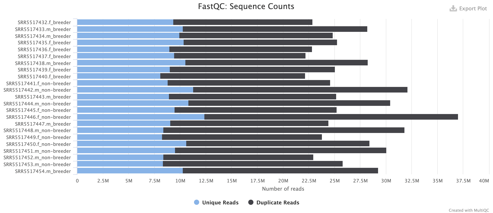
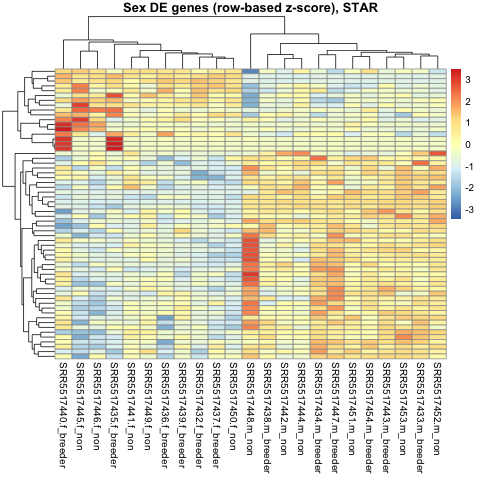
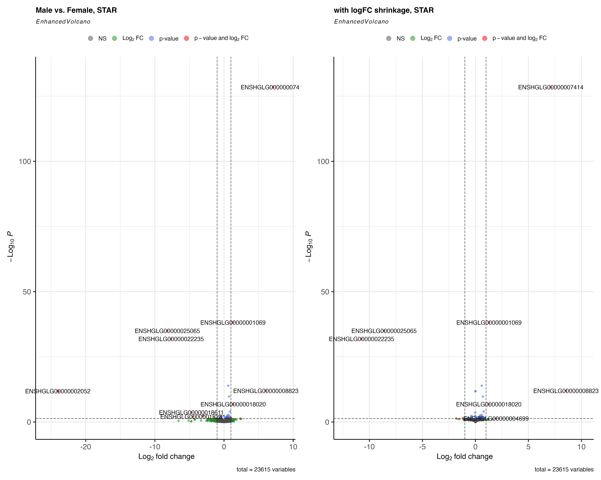

```{css style_settings, echo = FALSE}
blockquote { 
    font-size: 14px; 
    font-style: italic;
}
h1{
    font-size: 22px;
}
h2{
    font-size: 20px;
}
h3{
    font-size: 18px;
}
h4{
    font-size: 16px;
}

```

# Introduction

The naked mole rat (Heterocephalus glaber) is a extraordinarily long-lived mammal, and has been the focus of study for cancer and aging. The maximum lifespan of the naked mole-rat can exceed 30 years, and are resistant to both cancer and tumorigenesis -- distinct from its close relative, such as the Guinea pig and the Damaraland mole rat, of similar size, but are susceptible to cancer and do not have a life-span as long (1,2,3).

Naked mole rat genomics haven't been studied as thorough as other organisms. In 2011, Kim et al. has published a paper on the physiology of naked-mole rat, identifying some candidate genes, for example, SMAD3, that might be responsible for protecting naked-mole rats from cancer (2). However, this conclusion has been challenged by Delsuc et al., as some mutations are shared by the Guniea pigs, and that Kim has failed to account for some overlooked factors in the analysis study (4). 

In 2018, Bens et al. conducted a comparative transcriptome study between Naked mole rats and Guinea pigs, and reveals transcriptome patterns in breeder naked mole rats which might contribute to the long life span (1). Their conclusion was that non-breeder naked mole-rats show low levels of differentiation between sexes comparing to non-breeder guinea pig, and after transition into breeders, naked mole rat transcriptomes become remarkably sex-specific. Since this is a study comparing across species, I thought to conduct a comparison within the naked mole-rat population to see if there are differentially expressed genes within the species of interest. Additionally, I was interested in looking at if using different alignment tools produce different results. I downloaded their data on the liver RNAs of naked mole rats, analyzed and compared within the naked mole rat population. 

**Hypothesis**: There are differentially expressed genes between male and female, as well as between breeder and non-breeder naked mole rats. Using STAR or HISAT2 as alignment tool will affect the result. 

# Results

## FASTQ Quality

First, the quality of the fastq sequences obtained are accessed to decide if data processing is needed before alignment. As shown in the figures, the quality, GC contents and duplication are acceptable to continue to alignment without adapter trimming. In addition, in Checkpoint1 I have performed a test sample with trimgalore, and compared the FASTQC between trimmed and untrimmed. The results showed that no much difference is captured. See checkpoint1 html file.

### Sequence Counts


### GC Contents

### Duplication Level


## Alignment Quality

I have performed both STAR and HISAT2 alignments on the same set of RNA data, since comparing different tools might account for some systematic error. Both methods return nice alignment scores of more than 90%.

### STAR Alignment Score Plot

STAR alignment score plot shows that for all samples, most of sequences are uniquely mapped, and we have obtained a good amount of counts to proceed to analysis.


### HISAT2 Alignment Score Plot

HISAT2 alignment score plot shows that for all samples, most of sequences are uniquely mapped, and we have obtained a good amount of counts to proceed to analysis.

**HISAT 2: Alignment Scores**


### Read Distribution Plot

Then, the read distribution of both aligned results are accessed. For STAR, most of the reads obtained are exons, which is expected to proceed to analysis. UTR regions can be decreased in the feature counts step.

**STAR Read Distribution**

Similar results are shown for HISAT2 alignement as well. 

**HISAT2 Read Distribution**

I have concluded that the quality of alignment is ready to proceed to analyzing the differential expression. 

### Gene Body Coverage Plot

Both STAR and HISAT2 did similarly on gene body coverage. The coverage was uniform with sight drop on the 5' and 3' ends. 

**STAR Gene Coverage**


**HISAT2 Gene Coverage**


## ReadCount Summary

### Female Sample Feature Count Summary

Below is a summary of the read counts data for female samples of both STAR and HISAT2. Because STAR does not show unmapped reads, it explains who HISAT2 has fewer unassigned reads comparing to STAR, while HISAT2 also has unmapped reads. 


For the male summary plot, the result was similar.

### Male Sample Feature Count Summary


## DESeq Quality

### PCA

For the DESeq analysis, I have included sex and breed as design conditions, and below are the PCA plots for each features with each method, respectively. 

#### HISAT2

**Breed**


**Sex**


#### HISAT2

**Breed**


**Sex**


They indeed account for some variations within the population, for both alignment measures. 

## Differential Expression Analysis

### Heatmap

As an overview, the scaled heatmap for breed status test and sex test, and for both aligners are shown below.

#### Sex:STAR



#### Sex:HISAT2


#### Breed:STAR


#### Breed:HISAT2


### Specific Genes with Most Test Significance

Shown below are the top 10 differential expressed genes when tested against sex and breed status, for HISAT2 and STAR respectively. The top 100 genes are written into .csv files and saved to the git repository. 

They are: 

Results_test_breed_HISAT2_top100.csv	
Results_test_breed_STAR_top100.csv
Results_test_sex_HISAT2_top100.csv	
Results_test_sex_STAR_top100.csv

#### Top 10 Differentially Regulated Genes (Sex: Female vs. Male)


**STAR**


**HISAT2**


Both aligners give similar results, but there are still some differences on the ranking and adjusted p-values.

#### Top 10 Differentially Regulated Genes (Breed: Non-breeder vs. Breeder)


**STAR**


**HISAT2**


I have then identified some candidate genes (with gene names) to specifically look at their expression between groups. 

### Sex: PNPLA4 

[PNPLA4](https://www.genecards.org/cgi-bin/carddisp.pl?gene=PNPLA4) encodes for an enzyme that has both triacylglycerol lipase and transacylase activities and may be involved in adipocyte triglyceride homeostasis.


**STAR**


**HISAT2**


### Sex: RAB9A

[RAB9A](https://www.genecards.org/cgi-bin/carddisp.pl?gene=RAB9A) enables GDP binding activity; GTP binding activity; and GTPase activity. Involved in negative regulation by host of symbiont catalytic activity; positive regulation of exocytosis; and regulation of protein localization. 


**STAR**


**HISAT2**


### Breed: MYH7

[MYH7](https://www.genecards.org/cgi-bin/carddisp.pl?gene=MYH7) encodes the beta (or slow) heavy chain subunit of cardiac myosin.


**STAR**


**HISAT2**


We see that sex is indeed a covariate that should be accounted for for these genes shown above. However, such difference is not especially shown for the testing for breed status. It seems that a specific subset shows significant difference in expression for MYH7.

### Volcano Plots

At last, I plotted out all the up and down regulated genes when performing the 2 tests, using STAR and HISAT2 as alignment tool, respectively.

#### STAR: Volcano for female vs. male



#### HISAT2: Volcano for female vs. male


#### STAR: Volcano for female vs. male


#### HISAT2: Volcano for female vs. male


## Conclusion

### STAR vs. HISAT2

In this analysis, both tools performed similarly on the alignment, although because STAR does not output unmapped results, and other algorithm differences, the output gene ranking by adjusted p-value is slightly different.

### Sex as a Covariate

I conclude that there are several differentially expressed genes between the male ans female naked mole rat population. When comparing across species, it is suggested that this factor is considered.

### Non-breeder vs. breeder

I conclude that on liver expression, there are no significant differential expression genes between the non-breeder and breeder population. Although, directly graphing the genes showed that there are variabilities within the breeder/non-breeder sample. Smore samples would be helpful to determine if the few outliers have other confounding factors hidden.

### Limit of Data

This set of data is probably the one and only set available for naked mole rat expression that fulfills the number of biological and technical replicates for our analysis, so we just have to trust the technical process of it -- there is no cross validation. Also, for their close relative, like guinea pig and darama mole rat, there is even less datasets that have enough replicate. 
Also, for the reference, to keep gene annotations consistent, I had to use female referencing index for all - this will be challenging when applying on other organs.  

# Methods

## File Download and Preparation

### 1. File Download 

The reference genomes for naked mole rats are found in Ensembl. Only female reference genes are used, since the male genomes have unconventional naming for gene_id. Liver differential expression RNA analysis will be conducted between male and female, as well as breeder and non-breeder samples.  

Female gtf are located [here](http://ftp.ensembl.org/pub/current_gtf/heterocephalus_glaber_female/)

The data is accessible from NCBI SRA/GEO dataset under project number PRJNA386015. The link to the SRA run selector is [here](https://www.ncbi.nlm.nih.gov/Traces/study/?acc=PRJNA386015&o=acc_s%3Aa). There are 12 male samples and 11 female samples. 

#### a. Copy all NMR liver files to the project

```bash
#download the metadata file (liver for all NMR) and put it into my directory
scp "C:/Users/tof4003/Desktop/WCM/W2022/CMPB 5004/Project/SraRunTable_liver.txt" tof4003@aphrodite.med.cornell.edu:/athena/angsd/scratch/tof4003/project

head -5 SraRunTable_liver.txt
```
Looking into Accession Table
```
Run,Age,Assay Type,AvgSpotLen,Bases,BioProject,BioSample,Bytes,Center Name,Consent,DATASTORE filetype,DATASTORE provider,DATASTORE region,Experiment,GEO_Accession (exp),Instrument,LibraryLayout,LibrarySelection,LibrarySource,Organism,Platform,ReleaseDate,reproductive_status,Sample Name,sex,source_name,SRA Study,tissue,strain
SRR5517432,3.7 years,RNA-Seq,50,1143144100,PRJNA385850,SAMN06917366,753974373,GEO,public,"fastq,sra","gs,ncbi,s3","gs.US,ncbi.public,s3.us-east-1",SRX2790801,GSM2609133,Illumina HiSeq 2500,SINGLE,cDNA,TRANSCRIPTOMIC,Heterocephalus glaber,ILLUMINA,2018-06-14T00:00:00Z,breeder,GSM2609133,female,liver,SRP106650,liver,
SRR5517435,3.6 years,RNA-Seq,50,1263344450,PRJNA385850,SAMN06917363,850450852,GEO,public,"fastq,sra","gs,ncbi,s3","gs.US,ncbi.public,s3.us-east-1",SRX2790804,GSM2609136,Illumina HiSeq 2500,SINGLE,cDNA,TRANSCRIPTOMIC,Heterocephalus glaber,ILLUMINA,2018-06-14T00:00:00Z,breeder,GSM2609136,female,liver,SRP106650,liver,
SRR5517437,3.7 years,RNA-Seq,50,1109269000,PRJNA385850,SAMN06917361,731997749,GEO,public,"fastq,sra","gs,ncbi,s3","gs.US,ncbi.public,s3.us-east-1",SRX2790806,GSM2609138,Illumina HiSeq 2500,SINGLE,cDNA,TRANSCRIPTOMIC,Heterocephalus glaber,ILLUMINA,2018-06-14T00:00:00Z,breeder,GSM2609138,female,liver,SRP106650,liver,
SRR5517441,2.4 years,RNA-Seq,51,1253621004,PRJNA385850,SAMN06917357,846076900,GEO,public,"fastq,sra","gs,ncbi,s3","gs.US,ncbi.public,s3.us-east-1",SRX2790810,GSM2609142,Illumina HiSeq 2500,SINGLE,cDNA,TRANSCRIPTOMIC,Heterocephalus glaber,ILLUMINA,2018-06-14T00:00:00Z,non-breeder,GSM2609142,female,liver,SRP106650,liver,

```
The run is field 1, reproduction status is field 28, sex is field 30

```bash

#download data
awk -F "," '{ if($30 == "male") print $1","$28}' SraRunTable_liver.txt > liver_male.txt
awk -F "," '{ if($30 == "female") print $1","$28}' SraRunTable_liver.txt > liver_female.txt

mkdir -p lvr_male
mkdir -p lvr_female

#had to sbatch because this process took a long time
nano data_acc.sh
#! /bin/bash -l
#SBATCH --partition=angsd_class
#SBATCH --account=angsd_class
#SBATCH --nodes=1
#SBATCH --ntasks=1
#SBATCH --job-name=SRA_run
#SBATCH --time=15:00:00 #HH/MM/SS
#SBATCH --mem=10G

#load SRA toolkit
spack load sra-toolkit@2.8.2-1%gcc@6.3.0
cd /athena/angsd/scratch/tof4003/project
#clear the sra directory
rm -r /home/tof4003/ncbi
while read line; do
    echo $line
    acc=$(cut -d "," -f 1 <<< "$line")
    breed=$(cut -d "," -f 2 <<< "$line")
    prefetch $acc
    #change to fastq format
    fastq-dump /home/tof4003/ncbi/public/sra/$acc.sra -O /athena/angsd/scratch/tof4003/project/lvr_male
    #rename the file
    mv /athena/angsd/scratch/tof4003/project/lvr_male/$acc.fastq /athena/angsd/scratch/tof4003/project/lvr_male/$acc.m_$breed.fastq
done < /athena/angsd/scratch/tof4003/project/liver_male.txt
rm -r /home/tof4003/ncbi
while read line; do
    echo $line
    acc=$(cut -d "," -f 1 <<< "$line")
    breed=$(cut -d "," -f 2 <<< "$line")
    prefetch $acc
    #change to fastq format
    fastq-dump /home/tof4003/ncbi/public/sra/$acc.sra -O /athena/angsd/scratch/tof4003/project/lvr_female
    #rename the file
    mv /athena/angsd/scratch/tof4003/project/lvr_female/$acc.fastq /athena/angsd/scratch/tof4003/project/lvr_female/$acc.f_$breed.fastq
done < /athena/angsd/scratch/tof4003/project/liver_female.txt

sbatch data_acc.sh
#cleaning the temp files
rm -r /home/tof4003/ncbi

#download reference
mkdir -p NMR_ref

nano ref_d.sh

#! /bin/bash -l
#SBATCH --partition=angsd_class
#SBATCH --account=angsd_class
#SBATCH --nodes=1
#SBATCH --ntasks=1
#SBATCH --job-name=SRA_run
#SBATCH --time=15:00:00 #HH/MM/SS
#SBATCH --mem=10G

wget -O NMR_ref/femaleNMR.gtf.gz http://ftp.ensembl.org/pub/current_gtf/heterocephalus_glaber_female/Heterocephalus_glaber_female.HetGla_female_1.0.105.gtf.gz
#need to also download the reference fasta dna file
wget -O NMR_ref/NMR_female_dna.fa.gz http://ftp.ensembl.org/pub/current_fasta/heterocephalus_glaber_female/dna/Heterocephalus_glaber_female.HetGla_female_1.0.dna.toplevel.fa.gz

#unzip .gtf and .fa files
zcat /athena/angsd/scratch/tof4003/project/NMR_ref/femaleNMR.gtf.gz > /athena/angsd/scratch/tof4003/project/NMR_ref/femaleNMR.gtf
zcat /athena/angsd/scratch/tof4003/project/NMR_ref/NMR_female_dna.fa.gz > /athena/angsd/scratch/tof4003/project/NMR_ref/NMR_ref_female.fa

sbatch ref_d.sh

head -10 NMR_ref/femaleNMR.gtf
```

Features in the .gtf file
```
#!genome-build HetGla_female_1.0
#!genome-version HetGla_female_1.0
#!genome-date 2012-02
#!genome-build-accession GCA_000247695.1
#!genebuild-last-updated 2017-07
JH602043.1	ensembl	gene	4190633	4194963	.	-	.	gene_id "ENSHGLG00000010267"; gene_version "1"; gene_name "ZMYND10"; gene_source "ensembl"; gene_biotype "protein_coding";
JH602043.1	ensembl	transcript	4190633	4194963	.	-	.	gene_id "ENSHGLG00000010267"; gene_version "1"; transcript_id "ENSHGLT00000014491"; transcript_version "1"; gene_name "ZMYND10"; gene_source "ensembl"; gene_biotype "protein_coding"; transcript_name "ZMYND10-201"; transcript_source "ensembl"; transcript_biotype "protein_coding";
JH602043.1	ensembl	exon	4194756	4194963	.	-	.	gene_id "ENSHGLG00000010267"; gene_version "1"; transcript_id "ENSHGLT00000014491"; transcript_version "1"; exon_number "1"; gene_name "ZMYND10"; gene_source "ensembl"; gene_biotype "protein_coding"; transcript_name "ZMYND10-201"; transcript_source "ensembl"; transcript_biotype "protein_coding"; exon_id "ENSHGLE00000106764"; exon_version "1";
JH602043.1	ensembl	CDS	4194756	4194847	.	-	0	gene_id "ENSHGLG00000010267"; gene_version "1"; transcript_id "ENSHGLT00000014491"; transcript_version "1"; exon_number "1"; gene_name "ZMYND10"; gene_source "ensembl"; gene_biotype "protein_coding"; transcript_name "ZMYND10-201"; transcript_source "ensembl"; transcript_biotype "protein_coding"; protein_id "ENSHGLP00000014347"; protein_version "1";
JH602043.1	ensembl	start_codon	4194845	4194847	.	-	0	gene_id "ENSHGLG00000010267"; gene_version "1"; transcript_id "ENSHGLT00000014491"; transcript_version "1"; exon_number "1"; gene_name "ZMYND10"; gene_source "ensembl"; gene_biotype "protein_coding"; transcript_name "ZMYND10-201"; transcript_source "ensembl"; transcript_biotype "protein_coding";
```
It will be useful to keep the gene_name and gene_biotype in the analysis.


#### b. creating Index

Create STAR index for NMR female, with editing the resource request to speed up as suggested.

```bash

mkdir -p star_liver
nano star_liver/star_female_ref.sh

#! /bin/bash -l
#SBATCH --partition=angsd_class
#SBATCH --account=angsd_class
#SBATCH --nodes=1
#SBATCH #SBATCH --cpus-per-task=4 #try multiple threads with multiple cpu
#SBATCH --job-name=REf_gen_STAR
#SBATCH --time=48:00:00 #HH/MM/SS
#SBATCH --mem=100G

cd /athena/angsd/scratch/tof4003/project/NMR_ref
mkdir -p STAR_ref_female
#load STAR
spack load star@2.7.0e
STAR --runMode genomeGenerate \
--runThreadN 4 \
--genomeDir STAR_ref_female \
--genomeFastaFiles NMR_ref_female.fa \
--sjdbGTFfile femaleNMR.gtf \
--limitGenomeGenerateRAM 100326568150 \
--sjdbOverhang 99

sbatch star_liver/star_female_ref.sh
```


#### c. Checking Quality of fastqc files

Run fastqc, then Multiqc on the fastq files. 

```bash
cd /athena/angsd/scratch/tof4003/project
#freeing some memories
nano gz.sh

#! /bin/bash -l
#SBATCH --partition=angsd_class
#SBATCH --account=angsd_class
#SBATCH --nodes=1
#SBATCH --ntasks=1
#SBATCH --job-name=zip_files
#SBATCH --time=15:00:00 #HH/MM/SS
#SBATCH --mem=8G

cd /athena/angsd/scratch/tof4003/project
gzip lvr_male/*.fastq lvr_male/*.fastq.gz
rm lvr_male/*.fastq
gzip lvr_female/*.fastq lvr_female/*fastq.gz
rm lvr_female/*.fastq

sbatch gz.sh

mkdir -p fastq_qc
cd fastq_qc
nano fastqc.sh 
#! /bin/bash -l
#SBATCH --partition=angsd_class
#SBATCH --account=angsd_class
#SBATCH --nodes=1
#SBATCH --job-name=fastqc
#SBATCH --time=12:00:00 #HH/MM/SS
#SBATCH --mem=8G

spack load fastqc
cd /athena/angsd/scratch/tof4003/project/lvr_male
for file in *.fastq.gz ; do
  echo $file
  fastqc $file -o /athena/angsd/scratch/tof4003/project/fastq_qc
done
cd /athena/angsd/scratch/tof4003/project/lvr_female
for file in *.fastq.gz ; do
  echo $file
  fastqc $file -o /athena/angsd/scratch/tof4003/project/fastq_qc
done
#then, run a multiqc
cd /athena/angsd/scratch/tof4003/project/fastq_qc
spack load -r py-multiqc
multiqc .

sbatch fastqc.sh

ls fastq_qc

-exit-
#file download in cmd
scp tof4003@aphrodite.med.cornell.edu:/athena/angsd/scratch/tof4003/project/fastq_qc/multiqc_report.html "/Users/phoebefei/Desktop/WCM/W2022/CMPB 5004/Project/ANGSD Project tof4003/QC htmls/fastqc_report.html"

````

## Alignment

For the purpose of the question, both STAR and Hisat2 were run to access if the expression results differ. Performance-wise, STAR has taken more time and memory. Hisat2 has had generally stable performance.


### 1. Hisat2

```bash
mkdir -p liver_hisat2
cd liver_hisat2

nano hisat2_script.sh
#! /bin/bash -l
#SBATCH --partition=angsd_class
#SBATCH --account=angsd_class
#SBATCH --nodes=1
#SBATCH --cpus-per-task=4 #try multiple threads with multiple cpu
#SBATCH --job-name=Hisat2_tof4003
#SBATCH --time=48:00:00 #HH/MM/SS
#SBATCH --mem=60G

#load modules
spack load hisat2
spack load samtools@1.9% gcc@6.3.0
cd /athena/angsd/scratch/tof4003/project/NMR_ref
#Index the genome
mkdir -p hisat2_index_NMR_female
cd hisat2_index_NMR_female
hisat2-build -p 16 /athena/angsd/scratch/tof4003/project/NMR_ref/NMR_ref_female.fa HISAT2_NMR_female
cd /athena/angsd/scratch/tof4003/project/lvr_male

#run hisat2 alignment: reads are in fastq files, threads = 2; files are not pair-end reads
mkdir -p /athena/angsd/scratch/tof4003/project/liver_hisat2/out_male
for file in *.fastq.gz; do
  echo "Begin $file"
  fv=$(cut -d "." -f 1 <<< "$file")
  suf=$(cut -d "." -f 2 <<< "$file")
  hisat2 -q -p 2 -x /athena/angsd/scratch/tof4003/project/NMR_ref/hisat2_index_NMR_female/HISAT2_NMR_female --summary-file /athena/angsd/scratch/tof4003/project/liver_hisat2/$fv.$suf.summary.txt -U $file -S /athena/angsd/scratch/tof4003/project/liver_hisat2/out_male/$fv.$suf.hisat2.sam
  #use samtools to covert to bam, sort& index
  #sort & covert to bam
  samtools view -b /athena/angsd/scratch/tof4003/project/liver_hisat2/out_male/$fv.$suf.hisat2.sam | samtools sort -o /athena/angsd/scratch/tof4003/project/liver_hisat2/out_male/$fv.$suf.hisat2.sorted.bam
  #index
  samtools index /athena/angsd/scratch/tof4003/project/liver_hisat2/out_male/$fv.$suf.hisat2.sorted.bam
  echo "Hisat2 for $fv.$suf done"
  #remove .sam files to free up space
  rm /athena/angsd/scratch/tof4003/project/liver_hisat2/out_male/$fv.$suf.hisat2.sam
done

#females
cd /athena/angsd/scratch/tof4003/project/lvr_female

mkdir -p /athena/angsd/scratch/tof4003/project/liver_hisat2/out_female
for file in *.fastq.gz; do
  echo "Begin $file"
  fv=$(cut -d "." -f 1 <<< "$file")
  suf=$(cut -d "." -f 2 <<< "$file")
  hisat2 -q -p 2 -x /athena/angsd/scratch/tof4003/project/NMR_ref/hisat2_index_NMR_female/HISAT2_NMR_female --summary-file /athena/angsd/scratch/tof4003/project/liver_hisat2/$fv.$suf.summary.txt -U $file -S /athena/angsd/scratch/tof4003/project/liver_hisat2/out_female/$fv.$suf.hisat2.sam
  #use samtools to covert to bam, sort& index
  #sort & covert to bam
  samtools view -b /athena/angsd/scratch/tof4003/project/liver_hisat2/out_female/$fv.$suf.hisat2.sam | samtools sort -o /athena/angsd/scratch/tof4003/project/liver_hisat2/out_female/$fv.$suf.hisat2.sorted.bam
  #index
  samtools index /athena/angsd/scratch/tof4003/project/liver_hisat2/out_female/$fv.$suf.hisat2.sorted.bam
  echo "Hisat2 for $fv.$suf done"
  #remove .sam files to free up space
  rm /athena/angsd/scratch/tof4003/project/liver_hisat2/out_female/$fv.$suf.hisat2.sam
done

sbatch hisat2_script.sh

```

### 2. STAR

```bash
cd /athena/angsd/scratch/tof4003/project/star_liver

nano star_align.sh
#star actually gives core-dump issue for male genomes if not enough core is reserved. 

#! /bin/bash -l
#SBATCH --partition=angsd_class
#SBATCH --account=angsd_class
#SBATCH --nodes=1
#SBATCH --cpus-per-task=8
#SBATCH --job-name=STAR_align
#SBATCH --time=40:00:00 #HH/MM/SS
#SBATCH --mem=90G

#load modules
spack load star@2.7.0e
spack load samtools@1.9% gcc@6.3.0
cd /athena/angsd/scratch/tof4003/project/star_liver
#running STAR
for file in /athena/angsd/scratch/tof4003/project/lvr_male/*.fastq.gz; do
  echo "Begin $file"
  fv=$(cut -d "/" -f 8 <<< "$file" | cut -d "." -f 1 )
  suf=$(cut -d "/" -f 8 <<< "$file" | cut -d "." -f 2)
  STAR --runMode alignReads \
  --runThreadN 8 \
  --genomeDir /athena/angsd/scratch/tof4003/project/NMR_ref/STAR_ref_female \
  --readFilesCommand zcat \
  --readFilesIn $file \
  --outFileNamePrefix $fv.$suf.star. \
  --outSAMtype BAM SortedByCoordinate
  #use samtools to index
  #index
  samtools index $fv.$suf.star.Aligned.sortedByCoord.out.bam
  echo "star $fv.$suf done"
done
#females
for file in /athena/angsd/scratch/tof4003/project/lvr_female/*.fastq.gz; do
  echo "Begin $file"
  fv=$(cut -d "/" -f 8 <<< "$file" | cut -d "." -f 1 )
  suf=$(cut -d "/" -f 8 <<< "$file" | cut -d "." -f 2)
  STAR --runMode alignReads \
  --runThreadN 4 \
  --genomeDir /athena/angsd/scratch/tof4003/project/NMR_ref/STAR_ref_female \
  --readFilesCommand zcat \
  --readFilesIn $file \
  --outFileNamePrefix $fv.$suf.star. \
  --outSAMtype BAM SortedByCoordinate
  #use samtools to index
  #index
  samtools index $fv.$suf.star.Aligned.sortedByCoord.out.bam
  echo "star $fv.$suf done"
done

sbatch star_align.sh
```

## Alignement Quality Check

### 1. clearing the files

```bash
cd /athena/angsd/scratch/tof4003/project

#separate out the female and female files for star
mkdir -p star_liver/female_out
mkdir -p star_liver/male_out

mv star_liver/*f_* star_liver/female_out
mv star_liver/*m_* star_liver/male_out
```


### 2. Multiqc on the Output Reports


```bash
cd /athena/angsd/scratch/tof4003/project
mkdir -p alignment_repo
cd alignment_repo
mkdir -p star
mkdir -p hisat2
#copy the log files to directories 
cp /athena/angsd/scratch/tof4003/project/star_liver/male_out/*.Log.final.out star
cp /athena/angsd/scratch/tof4003/project/star_liver/female_out/*.Log.final.out star
cp /athena/angsd/scratch/tof4003/project/liver_hisat2/*.txt hisat2

nano align_multiqc.sh

#! /bin/bash -l
#SBATCH --partition=angsd_class
#SBATCH --account=angsd_class
#SBATCH --nodes=1
#SBATCH --job-name=bam_fastqc
#SBATCH --time=12:00:00 #HH/MM/SS
#SBATCH --mem=14G

cd /athena/angsd/scratch/tof4003/project/alignment_repo
#run multiqc
spack load -r py-multiqc
cd star
multiqc .
cd /athena/angsd/scratch/tof4003/project/alignment_repo/hisat2
multiqc .

sbatch align_multiqc.sh

#file download in cmd
scp tof4003@aphrodite.med.cornell.edu:/athena/angsd/scratch/tof4003/project/alignment_repo/hisat2/multiqc_report.html "/Users/phoebefei/Desktop/WCM/W2022/CMPB 5004/Project/ANGSD Project tof4003/QC htmls/hisat2_qc.html"

scp tof4003@aphrodite.med.cornell.edu:/athena/angsd/scratch/tof4003/project/alignment_repo/star/multiqc_report.html "/Users/phoebefei/Desktop/WCM/W2022/CMPB 5004/Project/ANGSD Project tof4003/QC htmls/star_qc.html"
```


### 3. RSeQC on bam file


#### a. Distribution

Download the .bed file from UCSC Table Browser

**.bed field input in UCSC**

Import and edit the .bed file

```bash
cd /athena/angsd/scratch/tof4003/project
mkdir -p RSeQC
--exit--
scp "/Users/phoebefei/Desktop/WCM/W2022/CMPB 5004/Project/ANGSD Project tof4003/NMR_female_ref.gz" tof4003@aphrodite.med.cornell.edu:/athena/angsd/scratch/tof4003/project/RSeQC/

cd /athena/angsd/scratch/tof4003/project/RSeQC
gunzip NMR_female_ref.gz
mv NMR_female_ref NMR_ref.bed
#my alignments all have a .1 after the chromosome name
awk -F "\t" '{OFS = "\t"}{$1=$1".1"; print $0}' < NMR_ref.bed > NMR_ref.1.bed
```

Running distribution on .bam files, STAR and HISAT2 Separate

```bash
mkdir -p distribution
mkdir -p distribution/star
mkdir -p distribution/hisat2
nano dis.sh
#! /bin/bash -l
#SBATCH --partition=angsd_class
#SBATCH --account=angsd_class
#SBATCH --nodes=1
#SBATCH --job-name=distribution
#SBATCH --time=12:00:00 #HH/MM/SS
#SBATCH --mem=8G

spack load -r py-rseqc@2.6.4
#star
cd /athena/angsd/scratch/tof4003/project/star_liver/male_out
for file in *.bam; do
 echo $file
 fv=$(awk -F "." '{print $1"."$2}' <<< $file)
 read_distribution.py -i ${file} \
 -r /athena/angsd/scratch/tof4003/project/RSeQC/NMR_ref.1.bed > \
 /athena/angsd/scratch/tof4003/project/RSeQC/distribution/star/${fv}_rseqc_distribution.out
done
cd /athena/angsd/scratch/tof4003/project/star_liver/female_out
for file in *.bam; do
 echo $file
 fv=$(awk -F "." '{print $1"."$2}' <<< $file)
 read_distribution.py -i ${file} \
 -r /athena/angsd/scratch/tof4003/project/RSeQC/NMR_ref.1.bed > \
 /athena/angsd/scratch/tof4003/project/RSeQC/distribution/star/${fv}_rseqc_distribution.out
done

#hisat2

cd /athena/angsd/scratch/tof4003/project/liver_hisat2/out_male
for file in *.bam; do
 echo $file
 fv=$(awk -F "." '{print $1"."$2}' <<< $file)
 read_distribution.py -i ${file} \
 -r /athena/angsd/scratch/tof4003/project/RSeQC/NMR_ref.1.bed > \
 /athena/angsd/scratch/tof4003/project/RSeQC/distribution/hisat2/${fv}_rseqc_distribution.out
done
cd /athena/angsd/scratch/tof4003/project/liver_hisat2/out_female
for file in *.bam; do
 echo $file
 fv=$(awk -F "." '{print $1"."$2}' <<< $file)
 read_distribution.py -i ${file} \
 -r /athena/angsd/scratch/tof4003/project/RSeQC/NMR_ref.1.bed > \
 /athena/angsd/scratch/tof4003/project/RSeQC/distribution/hisat2/${fv}_rseqc_distribution.out
done

#run multiqc, note that it is best to run multiqc outside the .sh file or as a different job, as sometimes the 2 packages (py-rseqc@2.6.4 & py-multiqc) interfere permission
spack load -r py-multiqc
cd /athena/angsd/scratch/tof4003/project/RSeQC/distribution/star
multiqc .
cd /athena/angsd/scratch/tof4003/project/RSeQC/distribution/hisat2
multiqc .

sbatch dis.sh

```

#### b. Coverage
 
Running coverage on .bam files, STAR and HISAT2 Separate. This step takes amazingly long time
```bash
cd /athena/angsd/scratch/tof4003/project/RSeQC
mkdir -p coverage
mkdir -p coverage/star
mkdir -p coverage/hisat2

nano coverage.sh
#! /bin/bash -l
#SBATCH --partition=angsd_class
#SBATCH --account=angsd_class
#SBATCH --nodes=1
#SBATCH --job-name=coverage
#SBATCH --time=50:00:00 #HH/MM/SS
#SBATCH --mem=8G
spack load -r py-rseqc@2.6.4

#star
cd /athena/angsd/scratch/tof4003/project/star_liver/male_out
for file in *.bam; do
 echo $file
 fv=$(awk -F "." '{print $1"."$2}' <<< $file)
 geneBody_coverage.py -i $file \
 -r /athena/angsd/scratch/tof4003/project/RSeQC/NMR_ref.1.bed \
 -o /athena/angsd/scratch/tof4003/project/RSeQC/coverage/star/${fv}_rseqc_coverage.out
done

cd /athena/angsd/scratch/tof4003/project/star_liver/female_out
for file in *.bam; do
 echo $file
 fv=$(awk -F "." '{print $1"."$2}' <<< $file)
 geneBody_coverage.py -i $file \
 -r /athena/angsd/scratch/tof4003/project/RSeQC/NMR_ref.1.bed \
 -o /athena/angsd/scratch/tof4003/project/RSeQC/coverage/star/${fv}_rseqc_coverage.out
done

#hisat2
cd /athena/angsd/scratch/tof4003/project/liver_hisat2/out_male
for file in *.bam; do
 echo $file
 fv=$(awk -F "." '{print $1"."$2}' <<< $file)
 geneBody_coverage.py -i $file \
 -r /athena/angsd/scratch/tof4003/project/RSeQC/NMR_ref.1.bed\
 -o /athena/angsd/scratch/tof4003/project/RSeQC/coverage/hisat2/${fv}_rseqc_coverage.out
done

cd /athena/angsd/scratch/tof4003/project/liver_hisat2/out_female
for file in *.bam; do
 echo $file
 fv=$(awk -F "." '{print $1"."$2}' <<< $file)
 geneBody_coverage.py -i $file \
 -r /athena/angsd/scratch/tof4003/project/RSeQC/NMR_ref.1.bed \
 -o /athena/angsd/scratch/tof4003/project/RSeQC/coverage/hisat2/${fv}_rseqc_coverage.out
done

#run multiqc, note that it is best to run multiqc outside the .sh file or as a different job, as sometimes the 2 packages (py-rseqc@2.6.4 & py-multiqc) interfere permission
spack load -r py-multiqc
cd /athena/angsd/scratch/tof4003/project/RSeQC/coverage/star
multiqc .
cd /athena/angsd/scratch/tof4003/project/RSeQC/coverage/hisat2
multiqc .

sbatch coverage.sh
```

file download
```bash
scp tof4003@aphrodite.med.cornell.edu:/athena/angsd/scratch/tof4003/project/RSeQC/distribution/hisat2/multiqc_report.html "/Users/phoebefei/Desktop/WCM/W2022/CMPB 5004/Project/ANGSD Project tof4003/QC htmls/ResQC_hisat2_distribution.html"
scp tof4003@aphrodite.med.cornell.edu:/athena/angsd/scratch/tof4003/project/RSeQC/distribution/star/multiqc_report.html "/Users/phoebefei/Desktop/WCM/W2022/CMPB 5004/Project/ANGSD Project tof4003/QC htmls/ResQC_star_distribution.html"
scp tof4003@aphrodite.med.cornell.edu:/athena/angsd/scratch/tof4003/project/RSeQC/coverage/hisat2/multiqc_report.html "/Users/phoebefei/Desktop/WCM/W2022/CMPB 5004/Project/ANGSD Project tof4003/QC htmls/ResQC_hisat2_coverage.html"
scp tof4003@aphrodite.med.cornell.edu:/athena/angsd/scratch/tof4003/project/RSeQC/coverage/star/multiqc_report.html "/Users/phoebefei/Desktop/WCM/W2022/CMPB 5004/Project/ANGSD Project tof4003/QC htmls/ResQC_star_coverage.html"
```

## Feature Counts

Feature counts are generated for STAR and HISAT2 separately. Here are the flags explained:

-Not including the "-O" (reads can be assigned to more than 1 matched exon, so if reads matched more than one exon, all of them will be counted). As discussed in the homework, the ambiguous reads are most likely UTR's so will be disgarded
-Deleting the -f flag so that only mapped genes are included 
-Include --extraAttributes for gene_biotype and gene_name

```bash

cd /athena/angsd/scratch/tof4003/project

#will generate count tables for star and hisat2 separately
mkdir -p featureCounts
cd featureCounts

nano featCounts.sh

#! /bin/bash -l
#SBATCH --partition=angsd_class
#SBATCH --account=angsd_class
#SBATCH --nodes=1
#SBATCH --job-name=feat_counts
#SBATCH --time=12:00:00 #HH/MM/SS
#SBATCH --mem=15G

cd /athena/angsd/scratch/tof4003/project
spack load subread

featureCounts -a NMR_ref/femaleNMR.gtf \
-o featureCounts/star_featCounts_maleNMR.txt \
-t exon \
-g gene_id \
--extraAttributes gene_name,gene_biotype \
-G NMR_ref/NMR_ref_female.fa \
star_liver/male_out/*.bam

featureCounts -a NMR_ref/femaleNMR.gtf \
-o featureCounts/star_featCounts_femaleNMR.txt \
-t exon \
-g gene_id \
--extraAttributes gene_name,gene_biotype \
-G NMR_ref/NMR_ref_female.fa \
star_liver/female_out/*.bam

featureCounts -a NMR_ref/femaleNMR.gtf \
-o featureCounts/hisat2_featCounts_maleNMR.txt \
-t exon \
-g gene_id \
--extraAttributes gene_name,gene_biotype \
-G NMR_ref/NMR_ref_female.fa \
liver_hisat2/out_male/*.bam

featureCounts -a NMR_ref/femaleNMR.gtf \
-o featureCounts/hisat2_featCounts_femaleNMR.txt \
-t exon \
-g gene_id \
--extraAttributes gene_name,gene_biotype \
-G NMR_ref/NMR_ref_female.fa \
liver_hisat2/out_female/*.bam

sbatch featCounts.sh
cat *.out


--------------file download

scp -r tof4003@aphrodite.med.cornell.edu:/athena/angsd/scratch/tof4003/project/featureCounts "/Users/phoebefei/Desktop/WCM/W2022/CMPB 5004/Project/ANGSD Project tof4003"

```

Output showing feature count .out for 1 of the run 
```

        ==========     _____ _    _ ____  _____  ______          _____  
        =====         / ____| |  | |  _ \|  __ \|  ____|   /\   |  __ \ 
          =====      | (___ | |  | | |_) | |__) | |__     /  \  | |  | |
            ====      \___ \| |  | |  _ <|  _  /|  __|   / /\ \ | |  | |
              ====    ____) | |__| | |_) | | \ \| |____ / ____ \| |__| |
        ==========   |_____/ \____/|____/|_|  \_\______/_/    \_\_____/
	  v1.6.2

//========================== featureCounts setting ===========================\\
||                                                                            ||
||             Input files : 11 BAM files                                     ||
||                           S SRR5517432.f_breeder.hisat2.sorted.bam         ||
||                           S SRR5517435.f_breeder.hisat2.sorted.bam         ||
||                           S SRR5517436.f_breeder.hisat2.sorted.bam         ||
||                           S SRR5517437.f_breeder.hisat2.sorted.bam         ||
||                           S SRR5517439.f_breeder.hisat2.sorted.bam         ||
||                           S SRR5517440.f_breeder.hisat2.sorted.bam         ||
||                           S SRR5517441.f_non-breeder.hisat2.sorted.bam     ||
||                           S SRR5517445.f_non-breeder.hisat2.sorted.bam     ||
||                           S SRR5517446.f_non-breeder.hisat2.sorted.bam     ||
||                           S SRR5517449.f_non-breeder.hisat2.sorted.bam     ||
||                           S SRR5517450.f_non-breeder.hisat2.sorted.bam     ||
||                                                                            ||
||             Output file : hisat2_featCounts_femaleNMR.txt                  ||
||                 Summary : hisat2_featCounts_femaleNMR.txt.summary          ||
||              Annotation : femaleNMR.gtf (GTF)                              ||
||      Dir for temp files : featureCounts                                    ||
||                                                                            ||
||                 Threads : 1                                                ||
||                   Level : meta-feature level                               ||
||              Paired-end : no                                               ||
||      Multimapping reads : not counted                                      ||
|| Multi-overlapping reads : not counted                                      ||
||   Min overlapping bases : 1                                                ||
||                                                                            ||
\\===================== http://subread.sourceforge.net/ ======================//

//================================= Running ==================================\\
||                                                                            ||
|| Load annotation file femaleNMR.gtf ...                                     ||
||    Features : 328743                                                       ||
||    Meta-features : 31806                                                   ||
||    Chromosomes/contigs : 460                                               ||
||                                                                            ||
|| Loading FASTA contigs : NMR_ref/NMR_ref_female.fa                          ||
||    4229 contigs were loaded                                                ||
||                                                                            ||
|| Process BAM file SRR5517432.f_breeder.hisat2.sorted.bam...                 ||
||    Single-end reads are included.                                          ||
||    Assign reads to features...                                             ||
||    Total reads : 24624992                                                  ||
||    Successfully assigned reads : 15990487 (64.9%)                          ||
||    Running time : 0.39 minutes                                             ||
||                                                                            ||
|| Process BAM file SRR5517435.f_breeder.hisat2.sorted.bam...                 ||
||    Single-end reads are included.                                          ||
||    Assign reads to features...                                             ||
||    Total reads : 26998998                                                  ||
||    Successfully assigned reads : 16586190 (61.4%)                          ||
||    Running time : 0.42 minutes                                             ||
||                                                                            ||
|| Process BAM file SRR5517436.f_breeder.hisat2.sorted.bam...                 ||
||    Single-end reads are included.                                          ||
||    Assign reads to features...                                             ||
||    Total reads : 24683617                                                  ||
||    Successfully assigned reads : 15471399 (62.7%)                          ||
||    Running time : 0.38 minutes                                             ||
||                                                                            ||
|| Process BAM file SRR5517437.f_breeder.hisat2.sorted.bam...                 ||
||    Single-end reads are included.                                          ||
||    Assign reads to features...                                             ||
||    Total reads : 23891994                                                  ||
||    Successfully assigned reads : 14360545 (60.1%)                          ||
||    Running time : 0.37 minutes                                             ||
||                                                                            ||
|| Process BAM file SRR5517439.f_breeder.hisat2.sorted.bam...                 ||
||    Single-end reads are included.                                          ||
||    Assign reads to features...                                             ||
||    Total reads : 26804951                                                  ||
||    Successfully assigned reads : 18015831 (67.2%)                          ||
||    Running time : 0.42 minutes                                             ||
||                                                                            ||
|| Process BAM file SRR5517440.f_breeder.hisat2.sorted.bam...                 ||
||    Single-end reads are included.                                          ||
||    Assign reads to features...                                             ||
||    Total reads : 24055201                                                  ||
||    Successfully assigned reads : 13953843 (58.0%)                          ||
||    Running time : 0.37 minutes                                             ||
||                                                                            ||
|| Process BAM file SRR5517441.f_non-breeder.hisat2.sorted.bam...             ||
||    Single-end reads are included.                                          ||
||    Assign reads to features...                                             ||
||    Total reads : 26251990                                                  ||
||    Successfully assigned reads : 17630134 (67.2%)                          ||
||    Running time : 0.41 minutes                                             ||
||                                                                            ||
|| Process BAM file SRR5517445.f_non-breeder.hisat2.sorted.bam...             ||
||    Single-end reads are included.                                          ||
||    Assign reads to features...                                             ||
||    Total reads : 27278979                                                  ||
||    Successfully assigned reads : 16961068 (62.2%)                          ||
||    Running time : 0.43 minutes                                             ||
||                                                                            ||
|| Process BAM file SRR5517446.f_non-breeder.hisat2.sorted.bam...             ||
||    Single-end reads are included.                                          ||
||    Assign reads to features...                                             ||
||    Total reads : 39704440                                                  ||
||    Successfully assigned reads : 25278167 (63.7%)                          ||
||    Running time : 0.62 minutes                                             ||
||                                                                            ||
|| Process BAM file SRR5517449.f_non-breeder.hisat2.sorted.bam...             ||
||    Single-end reads are included.                                          ||
||    Assign reads to features...                                             ||
||    Total reads : 25478196                                                  ||
||    Successfully assigned reads : 17352346 (68.1%)                          ||
||    Running time : 0.40 minutes                                             ||
||                                                                            ||
|| Process BAM file SRR5517450.f_non-breeder.hisat2.sorted.bam...             ||
||    Single-end reads are included.                                          ||
||    Assign reads to features...                                             ||
||    Total reads : 30450808                                                  ||
||    Successfully assigned reads : 19670289 (64.6%)                          ||
||    Running time : 0.48 minutes                                             ||
||                                                                            ||
||                         Read assignment finished.                          ||
||                                                                            ||
|| Summary of counting results can be found in file "featureCounts/hisat2_fe  ||
|| atCounts_femaleNMR.txt.summary"                                            ||
||                                                                            ||
\\===================== http://subread.sourceforge.net/ ======================//
```

## Analyze Count Data

### 1. Import and process the summary Table

```{r}
library(ggplot2)
library(magrittr)
direct <- '/Users/phoebefei/Desktop/WCM/W2022/CMPB 5004/Project/ANGSD Project tof4003/'
#hisat2 males & females
rchisat2f <-paste0(direct,"hisat2_featCounts_femaleNMR.txt.summary") %>%
  read.table(., header = TRUE)

rchisat2m <-paste0(direct,"hisat2_featCounts_maleNMR.txt.summary") %>%
  read.table(., header = TRUE)

#star males & females
rcstarf <-paste0(direct,"star_featCounts_femaleNMR.txt.summary") %>%
  read.table(., header = TRUE)

rcstarm <-paste0(direct,"star_featCounts_maleNMR.txt.summary") %>%
  read.table(., header = TRUE)
```

#### a. Clean the sample names

```{r}
library(stringr)
#reassign sample names
nameliststarm <- str_extract(names(rcstarm), "SRR[0-9]+.(m|f)_[a-z]+")
namelisthisat2m <- str_extract(names(rchisat2m), "SRR[0-9]+.(m|f)_[a-z]+")
nameliststarf <- str_extract(names(rcstarf), "SRR[0-9]+.(m|f)_[a-z]+")
namelisthisat2f <- str_extract(names(rchisat2f), "SRR[0-9]+.(m|f)_[a-z]+")
```
```{r}
#don't want the status to be modified
names(rcstarm)[2:length(rcstarm)] <- nameliststarm[2:length(nameliststarm)]
names(rcstarf)[2:length(rcstarf)] <- nameliststarf[2:length(nameliststarf)]
names(rchisat2m)[2:length(rchisat2m)] <- namelisthisat2m[2:length(namelisthisat2m)]

names(rchisat2f)[2:length(rchisat2f)] <- namelisthisat2f[2:length(namelisthisat2f)]
```

#### b.Plotting the .summary results

```{r}
library(patchwork)
library(reshape2)
#STAR M
melt_starm <- melt(rcstarm, id.vars = "Status")
names(melt_starm)[3] <- "Counts"
names(melt_starm)[2] <- "Sample"
#remove 0 instances
melt_starm <- subset(melt_starm, Counts!=0)
#add a row saying identifying this data
melt_starm["Type"] <- rep("Feature Count on Male using STAR",nrow(melt_starm))
#STAR F
melt_starf <- melt(rcstarf, id.vars = "Status")
names(melt_starf)[3] <- "Counts"
names(melt_starf)[2] <- "Sample"
melt_starf <- subset(melt_starf, Counts!=0)
melt_starf["Type"] <- rep("Feature Count on Female using STAR",nrow(melt_starf))

#Hisat2 M
melt_hisat2m <- melt(rchisat2m, id.vars = "Status")
names(melt_hisat2m)[3] <- "Counts"
names(melt_hisat2m)[2] <- "Sample"
melt_hisat2m <- subset(melt_hisat2m, Counts!=0)
melt_hisat2m["Type"] <- rep("Feature Count on Male using Hisat2",nrow(melt_hisat2m))

#Hisat2 F
melt_hisat2f <- melt(rchisat2f, id.vars = "Status")
names(melt_hisat2f)[3] <- "Counts"
names(melt_hisat2f)[2] <- "Sample"
melt_hisat2f <- subset(melt_hisat2f, Counts!=0)
melt_hisat2f["Type"] <- rep("Feature Count on Male using Hisat2",nrow(melt_hisat2f))
```
Male Alignment : STAR vs. Hisat2

```{r}
melt_m <- rbind(melt_starm,melt_hisat2m)
melt_f <- rbind(melt_starf,melt_hisat2f)
```

```{r fig.width = 15, fig.height = 8}
#set texts size
theme_set(theme(legend.position = "bottom",legend.key.size = unit(0.4, 'cm'),axis.text=element_text(size=10), axis.title=element_text(size=10)))
#bar plot the combined graph
plotm <- ggplot(data = melt_m,aes(x = Counts, y = Sample))+geom_bar(stat = 'identity', aes(fill = Status),position = "dodge")+facet_wrap(Type~., nrow =2, strip.position = "right")+ggtitle("Plot Based on Summary .txt Files for Males")+guides(fill=guide_legend(nrow=2,byrow=TRUE))
```
```{r, eval = FALSE}
ggsave("Male Sample Feature Count Summary.png")
```

```{r fig.width = 15, fig.height = 8}

#set texts size
theme_set(theme(legend.position = "bottom",legend.key.size = unit(0.4, 'cm'),axis.text=element_text(size=10), axis.title=element_text(size=10)))
#bar plot the combined graph
plotf <- ggplot(data = melt_f,aes(x = Counts, y = Sample))+geom_bar(stat = 'identity', aes(fill = Status),width = 1,position = "dodge")+facet_wrap(Type~., nrow =2, strip.position = "right")+ggtitle("Plot Based on Summary .txt Files")+guides(fill=guide_legend(nrow=2,byrow=TRUE))

```
```{r, eval = FALSE}
ggsave("Female Sample Feature Count Summary.png")
```

### 2. Create DESeq2 Objects

#### a. Import readcounts and assign sample names
```{r}
rchisat_f <-paste0(direct,"hisat2_featCounts_femaleNMR.txt") %>% read.table(., header = TRUE)
rchisat_m <- paste0(direct,"hisat2_featCounts_maleNMR.txt") %>% read.table(., header = TRUE)
rcstar_f <-paste0(direct,"star_featCounts_femaleNMR.txt") %>% read.table(., header = TRUE)
rcstar_m <- paste0(direct,"star_featCounts_maleNMR.txt") %>% read.table(., header = TRUE)
```

```{r}
#don't want the status to be modified
names(rcstar_m)[9:length(rcstar_m)] <- nameliststarm[2:length(nameliststarm)]
names(rcstar_f)[9:length(rcstar_f)] <- nameliststarf[2:length(nameliststarf)]
names(rchisat_m)[9:length(rchisat_m)] <- namelisthisat2m[2:length(namelisthisat2m)]
names(rchisat_f)[9:length(rchisat_f)] <- namelisthisat2f[2:length(namelisthisat2f)]
```


#### b. Merge male and female data and create rowData
```{r}
#create rowname and delete non-numerical data
#Star Males
row.names(rcstar_m) <- make.names(rcstar_m$Geneid)
star_m_row <-rcstar_m[,c(7:8),drop = FALSE]
rcstar_m <- rcstar_m[ ,-c(1:8)]

# Star Females
row.names(rcstar_f) <- make.names(rcstar_f$Geneid)
star_f_row <-rcstar_f[,c(7:8),drop = FALSE]
rcstar_f <- rcstar_f[ ,-c(1:8)]

#bind star
duprows <- rownames(star_f_row) %in% rownames(star_m_row)
star_row <- rbind(star_f_row, star_m_row[!duprows,])


# Hisat2 Males
row.names(rchisat_m) <- make.names(rchisat_m$Geneid)
hisat_m_row <-rchisat_m[,c(7:8),drop = FALSE]
rchisat_m <- rchisat_m[ ,-c(1:8)]

#Hisat2 Females
row.names(rchisat_f) <- make.names(rchisat_f$Geneid)
hisat_f_row <-rchisat_f[,c(7:8),drop = FALSE]
rchisat_f <- rchisat_f[ ,-c(1:8)]

#bind hisat2
duprows <- rownames(hisat_m_row) %in% rownames(hisat_f_row)
hisat2_row <- rbind(hisat_m_row, hisat_f_row[!duprows,])
```

```{r}
#merge & only keep same gene name

rcstar <- merge(rcstar_m, rcstar_f,by=0, all = TRUE)
rcstar[is.na(rcstar)] <- 0
rchisat <- merge(rchisat_f, rchisat_m,by=0, all = TRUE)
rchisat[is.na(rchisat)] <- 0
row.names(rcstar) <- make.names(rcstar$Row.names)
rcstar <- rcstar[, -c(1)]
row.names(rchisat) <- make.names(rchisat$Row.names)
rchisat <- rchisat[, -c(1)]
```


#### c. Create sex and breed condition

```{r}
star_level <- gsub("SRR[0-9]+.","",names(rcstar))
star_sex <- gsub("_.+","",star_level)
star_breed <- gsub("(m|f)_","",star_level)
hisat_level <- gsub("SRR[0-9]+.","",names(rchisat))
hisat_sex <- gsub("_.+","",hisat_level)
hisat_breed <- gsub("(m|f)_","",hisat_level)


```

```{r}
sampleinfo_hisat <- data.frame(breed = hisat_breed, sex = hisat_sex, row.names = names(rchisat))
sampleinfo_star <- data.frame(breed = star_breed, sex = star_sex ,row.names = names(rcstar))

```

#### d. Create DESeq2 objects including the processed information

Packages for DESeq and analysis
```{r, eval = FALSE}
BiocManager::install("DESeq2")
BiocManager::install("vsn")
BiocManager::install("plyranges")
BiocManager::install("apeglm")
BiocManager::install("EnhancedVolcano")
BiocManager::install("org.Sc.sgd.db") 
```

```{r, echo = FALSE}
library("DESeq2")
DESeq.star <- DESeqDataSetFromMatrix(countData = as.matrix(rcstar),
                                   colData = sampleinfo_star,
                                   rowData = star_row[rownames(rcstar),],
                                   design = ~ breed + sex ) 


DESeq.hisat <- DESeqDataSetFromMatrix(countData = as.matrix(rchisat),
                                   colData = sampleinfo_hisat,
                                   rowData = hisat2_row[rownames(rchisat),],
                                   design = ~ breed + sex ) 

```

### 3. Differential Expression Analysis on STAR Data 

#### a. Access Read Counts

Cleaning the data
```{r, eval = FALSE}
png("Count Information STAR.png")
par(mar=c(11, 4.1, 4.1, 2.1))
colSums(counts(DESeq.star)) %>% barplot(las=2, main = "Count Information STAR") 
dev.off()
```

```{r}
dim(DESeq.star)
keep_star <- rowSums(counts(DESeq.star)) > 0
DESeq.star <- DESeq.star[keep_star,]
dim(DESeq.star)
```

#### b. Calculate Size Factors

```{r}
# define a function to calculate the geometric mean
gm_mean <- function(x, na.rm=TRUE){ exp(sum(log(x[x > 0]), na.rm=na.rm) / length(x)) }

star_pseudo_ref <- counts(DESeq.star) %>% apply(., 1, gm_mean)
star_ref_ratio <- counts(DESeq.star) %>% apply(., 2, function(cts){ cts/star_pseudo_ref})

counts(DESeq.star)[1,]/star_pseudo_ref[1]
star_ref_ratio[1,]

apply(star_ref_ratio,2,median)
```

```{r}
DESeq.star <- estimateSizeFactors(DESeq.star)

```

```{r, eval = FALSE}
png("Library Size vs. Size Factors STAR.png")
plot(sizeFactors(DESeq.star), colSums(counts(DESeq.star)), ylab = "library sizes", xlab = "size factors", cex = 1, main = "Library Size vs. Size Factors \n (STAR)")
dev.off()
```

#### c. Normalization and Plotting Counts

Normalization 
```{r}
counts.star_norm <- counts(DESeq.star, normalized = TRUE)
```

```{r, eval = FALSE}
png("Boxplot of Normalized Read Count STAR.png")
par(mfrow=c(1,2))
par(mar=c(11, 4.1, 4.1, 2.1))
boxplot(counts.star_norm, main = "SF normalized \nSTAR", las = 2, cex = .6)
boxplot(counts(DESeq.star), main = "Read counts only \nSTAR", las = 2, cex = .6)
dev.off()
```
Boxplot of log2 transformation

```{r, eval = FALSE}
png("Boxplot of Normalized Logged Read Count STAR.png")
par(mfrow=c(1,2))
par(mar=c(11, 4.1, 4.1, 2.1))
boxplot(log2(counts(DESeq.star)+1), notch=FALSE, main = "Non-normalized read counts", ylab="log2(read counts)", cex = .6, las = 2)
boxplot(log2(counts(DESeq.star, normalize= TRUE)+1), notch=FALSE, main = "Size-factor-normalized read counts", ylab="log2(read counts)", cex = .6, las = 2)
dev.off()
```


Add the normalization datasets to the object

```{r}
assay(DESeq.star, "log.counts") <- log2(counts(DESeq.star, normalized = FALSE) + 1)
assay(DESeq.star, "log.norm.counts") <- log2(counts(DESeq.star, normalized = TRUE) + 1)
```

#### d. Mean SD plot

```{r}
library(vsn)
```
```{r, eval = FALSE}
par(mfrow=c(1,1))
par(mar=c(11, 4.1, 4.1, 2.1))
star_msd <- vsn::meanSdPlot(DESeq.star@assays@data@listData$log.norm.counts, ranks=FALSE, plot = FALSE)
star_msd_gg <- star_msd$gg + ggtitle("Sequencing depth normalized log2(read counts) for STAR") + ylab("standard deviation")
ggsave("Mean SD Plot (STAR).png")
```

#### e. PCA Plot

```{r}
DESeq.star.trans <-DESeqTransform(DESeq.star)
```

```{r, eval = FALSE}
pca_sex_star <- plotPCA(DESeq.star.trans,
  intgroup = 'sex',
  returnData = FALSE) + ggtitle("PCA Plot Based on Sex, STAR")
ggsave("PCA Based on Sex STAR.png")
pca_breed_star <- plotPCA(DESeq.star.trans,
  intgroup = 'breed',
  returnData = FALSE) + ggtitle("PCA Plot Based on Breed Status, STAR")
ggsave("PCA Based on Breed Status STAR.png")
```

#### f. Reducing dependencies

```{r}
DESeq.star.rlog <- rlog(DESeq.star, blind = TRUE)

```
```{r, eval = FALSE}
png("SRR5517434 vs SRR5517433 STAR.png")
par(mfrow=c(1,2))

plot(DESeq.star@assays@data@listData$log.norm.counts[,1:2], cex=.1,main = "Size Factor and Log2-transformed \n STAR")

plot(assay(DESeq.star.rlog)[,1], assay(DESeq.star.rlog)[,2], cex=.1, main = "Rlog Transformed \n STAR", xlab = colnames(assay(DESeq.star.rlog[,1])), ylab = colnames(assay(DESeq.star.rlog[,2])) )
dev.off()
```

Mean SD plot after reducing dependencies

```{r,eval = FALSE}
star_msd_rlog <- vsn::meanSdPlot(assay(DESeq.star.rlog), ranks=FALSE, plot = FALSE)
star_msd_rlog_gg<- star_msd_rlog$gg + ggtitle("Mean SD plot Following rlog Transformation") +
coord_cartesian(ylim = c(0,3))
ggsave("Mean SD plot Following rlog Transformation STAR.png")
```

#### g. Interpret the Expression Results

Re-level the conditions

```{r}
DESeq.star$sex <- relevel(DESeq.star$sex, ref = "f")
DESeq.star$breed <- relevel(DESeq.star$breed, ref = "breeder")
DESeq.star$sex
DESeq.star$breed
```
Running the analysis

```{r}
DESeq.star <- DESeq(DESeq.star)
DESeq.star
```

Hypothesis testing

```{r}
### significance levels
MIN_FC=2
MIN_L2FC=log2(MIN_FC)
MAX_QVAL=0.05

### output controls
N_TOP_GENES=100

```
**Sex**
```{r}
library(tidyverse)
FOI = "sex"
Level_0 = "m"
Level_1 = "f"
star.results.sex <- results(DESeq.star, saveCols = c("gene_biotype", "gene_name"),independentFiltering = TRUE, contrast = c(FOI, Level_0, Level_1)) %>%
  as_tibble(rownames = "gene") %>%
  dplyr::select(gene_biotype, gene_name, gene, everything()) %>%
  arrange(padj)
```

```{r, eval = FALSE}
star.results.sex %>% filter(log2FoldChange >= MIN_L2FC | log2FoldChange <= -MIN_L2FC) %>% head(n=N_TOP_GENES) %>% write.csv(.,"Results_test_sex_STAR_top100.csv")
```

**Breeder vs. non-breeder**
```{r}

FOI = "breed"
Level_0 = "non"
Level_1 = "breeder"
star.results.breed <- results(DESeq.star, saveCols = c("gene_biotype", "gene_name"),independentFiltering = TRUE, contrast = c(FOI, Level_0, Level_1)) %>%
  as_tibble(rownames = "gene") %>%
  dplyr::select(gene_name,gene_biotype, gene, everything()) %>%
  arrange(padj)
```

```{r, eval = FALSE}
star.results.breed %>% filter(log2FoldChange >= MIN_L2FC | log2FoldChange <= -MIN_L2FC) %>%
  head(n=N_TOP_GENES) %>%
  write.csv(.,"Results_test_breed_STAR_top100.csv")
```

#### h. Visualizing the Expression

>Adjusted p-value histogram

```{r, eval = FALSE}
png("Histogram of adj.p testing sex STAR.png")
star_hist_sex <- hist(star.results.sex$padj,
col="grey", border="white", xlab="", ylab="",
main="Frequencies of adj. p-values\n(all genes) for STAR, based on sex",
cex = 0.4)
dev.off()
```

```{r, eval = FALSE}
png("Histogram of adj.p testing breed STAR.png")
hist(star.results.breed$padj,
col="grey", border="white", xlab="", ylab="",
main="frequencies of adj. p-values\n(all genes) for STAR, breeder/non-breeder comparision",
cex = 0.4)
dev.off()
```

>Sorted table of results

**Sex**
```{r}
star.results.sex.sorted <- star.results.sex[order(star.results.sex$padj), ]
#head(star.results.sex.sorted, 10)
```
**Breed status**

```{r}
star.results.breed.sorted <- star.results.breed[order(star.results.breed$padj), ]
#head(star.results.breed.sorted, 10)
```
>DE of Selected Genes

**Sex**

```{r fig.width = 15, fig.height = 10, eval = FALSE}
png("RAB9A DE Count Sex STAR.png")
par(mfrow=c(1,2))
plotCounts(DESeq.star, gene = "ENSHGLG00000001069" , intgroup = "sex", normalized = TRUE, main = "ENSHGLG00000001069/RAB9A \n STAR")
plotCounts(DESeq.star, gene = which.max(star.results.sex$padj),  intgroup = "sex",main = "Gene with max p.adj.(=least) \n on sex (STAR)")
dev.off()
```

```{r fig.width = 15, fig.height = 10, eval = FALSE}
png("PNPLA4 DE Count Sex STAR.png")
par(mfrow=c(1,2))
plotCounts(DESeq.star, gene = "ENSHGLG00000000567" , intgroup = "sex", normalized = TRUE, main = "ENSHGLG00000000567\n-PNPLA4 STAR")
plotCounts(DESeq.star, gene = which.max(star.results.sex$padj),  intgroup = "sex",main = "Gene with max p.adj.(=least) \n on sex (STAR)")
dev.off()
```

**Breed**

```{r fig.width = 15, fig.height = 10, eval = FALSE}
png("MYH7 DE Count Breed STAR.png")
par(mfrow=c(1,2))
plotCounts(DESeq.star, gene = "ENSHGLG00000002052" , intgroup = "breed", normalized = TRUE, main = "ENSHGLG00000002052\n-MYH7 STAR ")
plotCounts(DESeq.star, gene = which.max(star.results.breed$padj),  intgroup = "breed",main = "Gene with max p.adj.(=least) \n for breed")
dev.off()
```


>Heatmap

**Sex**
```{r}
star.genes.sex <- subset(star.results.sex.sorted, padj < 0.05)$gene

rlog.star.sex <- DESeq.star.rlog[star.genes.sex,] %>% assay
library(pheatmap)
```

```{r, eval = FALSE}
png("Heatmap STAR sex(no scale).png")
star_heat_sex <- pheatmap(rlog.star.sex, scale="none",
show_rownames = FALSE, main = "Sex DE genes (no scaling), STAR",
color = colorRampPalette(RColorBrewer::brewer.pal(n = 7, name =
"Reds"))(100))
dev.off()
```

```{r, eval = FALSE}
png("Heatmap STAR sex (scaled).png")
pheatmap(rlog.star.sex, scale="row",
show_rownames = FALSE, main = "Sex DE genes (row-based z-score), STAR")
dev.off()
```

**Breed Status**
```{r}
star.genes.breed <- subset(star.results.breed.sorted, padj < 0.05 )$gene

rlog.star.breed <- DESeq.star.rlog[star.genes.breed,] %>% assay
```

```{r, eval = FALSE}
png("Heatmap STAR breed (no scale).png")
pheatmap(rlog.star.breed, scale="none",
show_rownames = FALSE, main = "Breed Status DE genes (no scaling), STAR",
color = colorRampPalette(RColorBrewer::brewer.pal(n = 7, name =
"Reds"))(100))
dev.off()
png("Heatmap STAR breed (scaled).png")
pheatmap(rlog.star.breed, scale="row",
show_rownames = FALSE, main = "Breed Status DE genes (row-based z-score), STAR")
dev.off()
```
>Plotting the FC Values/Shrinked FC Values

**plotMA**
```{r}
resultsNames(DESeq.star)
star.results.srk.sex <- lfcShrink(DESeq.star, coef = 3, type = "apeglm")
```

```{r fig.width = 15, fig.height = 8, eval = FALSE}
png("MA Plot STAR Sex.png")
par(mfrow = c(1,2))
star.results.sex$sig <- star.results.sex$padj < 0.05
plotMA(star.results.sex[,c("baseMean","log2FoldChange","sig")], alpha = 0.05,
main = "no shrinkage \n (for sex comparison), STAR", ylim = c(-4,4))

plotMA(star.results.srk.sex,
alpha = 0.05,
main = "with logFC shrinkage, STAR", ylim = c(-4,4))
dev.off()
```

```{r}

star.results.srk.breed <- lfcShrink(DESeq.star, coef = 2, type = "apeglm")
```
```{r, eval = FALSE}
png("MA Plot STAR Breed.png")
par(mfrow = c(1,2))
star.results.breed$sig <- star.results.breed$padj < 0.05
plotMA(star.results.breed[,c("baseMean","log2FoldChange","sig")], alpha = 0.05,
main = "no shrinkage \n(for breed comparison), STAR", ylim = c(-4,4))

plotMA(star.results.srk.breed,
alpha = 0.05,
main = "with logFC shrinkage, STAR", ylim = c(-4,4))
dev.off()
```

**Volcano plot**

```{r}
library(EnhancedVolcano)
```

```{r fig.width = 10, fig.height = 8, eval = FALSE}

#just going to directly go with the gene name
vpstarsex <- EnhancedVolcano(star.results.sex, lab = star.results.sex$gene, x = 'log2FoldChange', y = 'padj', pCutoff = 0.05, title = "Male vs. Female, STAR")
vpstarsexsrk <- EnhancedVolcano(star.results.srk.sex, lab = rownames(star.results.srk.sex), x = 'log2FoldChange', y = 'padj', pCutoff = 0.05, title = "with logFC shrinkage, STAR")
vpstarsex + vpstarsexsrk

ggsave("Volcano Plot STAR Sex.png")
```


```{r fig.width = 10, fig.height = 8, eval = FALSE}
vpstarb <- EnhancedVolcano(star.results.breed, lab = star.results.breed$gene, x = 'log2FoldChange', y = 'padj', pCutoff = 0.05, title = "Breeder vs. Non-breeder, STAR")
vpstarbsrk <- EnhancedVolcano(star.results.srk.breed, lab = rownames(star.results.srk.breed), x = 'log2FoldChange', y = 'padj', pCutoff = 0.05, title = "with logFC shrinkage, STAR")

vpstarb + vpstarbsrk

ggsave("Volcano Plot STAR Breed.png")
```

### 4. Differential Expression Analysis on STAR Data 

#### a. Cleaning the data
```{r,eval = FALSE}
png("Count Information HISAT2.png")
par(mar=c(11, 4.1, 4.1, 2.1))
colSums(counts(DESeq.hisat)) %>% barplot(las=2, main = "Count Information HISAT2")
dev.off()
```

```{r}
dim(DESeq.hisat)
keep_hisat <- rowSums(counts(DESeq.hisat)) > 0
DESeq.hisat <- DESeq.hisat[keep_hisat,]
dim(DESeq.hisat)
```

#### b. Calculate Size Factors


```{r}
DESeq.hisat <- estimateSizeFactors(DESeq.hisat)

```

```{r, eval = FALSE}
png("Library Size vs. Size Factors HISAT2.png")
plot(sizeFactors(DESeq.hisat), colSums(counts(DESeq.hisat)), ylab = "library sizes", xlab = "size factors", cex = 1, main = "Size Factor for HISAT2")
dev.off()
```

#### c. Normalization and Plotting Counts

```{r}

counts.hisat_norm<- counts(DESeq.hisat, normalized = TRUE)
```
```{r, eval = FALSE}
png("Boxplot of Normalized Read Count HISAT2.png")
par(mfrow=c(1,2))
par(mar=c(11, 4.1, 4.1, 2.1))
boxplot(counts.hisat_norm, main = "SF normalized (HISAT2)", las = 2, cex = .6)
boxplot(counts(DESeq.hisat), main = "Read counts only (HISAT2)", las = 2, cex = .6)
dev.off()
```
Boxplot of log2 transformation

```{r,eval = FALSE}
png("Boxplot of Normalized Logged Read Count HISAT2.png")
par(mfrow=c(1,2))
par(mar=c(11, 4.1, 4.1, 2.1))
boxplot(log2(counts(DESeq.hisat)+1), notch=FALSE, main = "Non-normalized \nread counts (HISAT2)", ylab="log2(read counts)", cex = .6, las = 2)

boxplot(log2(counts(DESeq.hisat, normalize= TRUE)+1), notch=FALSE, main = "Size-factor-normalized \nread counts (HISAT2) ", ylab="log2(read counts)", cex = .6, las = 2)

dev.off()
```


Add the normalization datasets to the object

```{r}
assay(DESeq.hisat, "log.counts") <- log2(counts(DESeq.hisat, normalized = FALSE) + 1)
assay(DESeq.hisat, "log.norm.counts") <- log2(counts(DESeq.hisat, normalized = TRUE) + 1)
```

#### d. Mean SD plot
```{r, eval = FALSE}
par(mfrow=c(1,1))
par(mar=c(11, 4.1, 4.1, 2.1))
hisat_msd <- vsn::meanSdPlot(DESeq.hisat@assays@data@listData$log.norm.counts, ranks=FALSE, plot = FALSE)
hisat_msd_gg <- hisat_msd$gg + ggtitle("Sequencing depth normalized log2(read counts) for HISAT2") + ylab("standard deviation")
ggsave("Mean SD Plot (HISAT2).png")
```


#### e. PCA Plot

```{r}
DESeq.hisat.trans <-DESeqTransform(DESeq.hisat)
```
```{r, eval = FALSE}
pca_sex_hisat <- plotPCA(DESeq.hisat.trans,
  intgroup = 'sex',
  returnData = FALSE) + ggtitle("PCA Plot for Sex, HISAT2")
ggsave("PCA Based on Sex HISAT2.png")

pca_breed_hisat<- plotPCA(DESeq.hisat.trans,
  intgroup = 'breed',
  returnData = FALSE) + ggtitle("PCA Plot for Breed, HISAT2")
ggsave("PCA Based on Breed HISAT2.png")
```

#### f. Reducing Dependencies

```{r}
DESeq.hisat.rlog <- rlog(DESeq.hisat, blind = TRUE)
```
```{r, eval = FALSE}
png("SRR5517434 vs SRR5517433 HISAT2.png")
par(mfrow=c(1,2))
plot(DESeq.hisat@assays@data@listData$log.norm.counts[,1:2], cex=.1,main = "size factor and log2-transformed \n(HISAT2) ")

plot(assay(DESeq.hisat.rlog)[,1], assay(DESeq.hisat.rlog)[,2], cex=.1, main = "rlog transformed \n(HISAT2)", xlab = colnames(assay(DESeq.hisat.rlog[,1])), ylab = colnames(assay(DESeq.hisat.rlog[,2])) )
dev.off()
```

Mean SD plot after reducing dependencies

```{r, eval = FALSE}
hisat_msd_rlog <- vsn::meanSdPlot(assay(DESeq.hisat.rlog), ranks=FALSE, plot = FALSE)
hisat_msd_rlog_gg<-hisat_msd_rlog$gg + ggtitle("Following rlog transformation (HISAT2)") +
coord_cartesian(ylim = c(0,3))
ggsave("Mean SD plot Following rlog Transformation HISAT2.png")
```

#### g. Interpret the Expression Results

Re-level the conditions

```{r}
DESeq.hisat$sex <- relevel(DESeq.hisat$sex, ref = "f")
DESeq.hisat$breed <- relevel(DESeq.hisat$breed, ref = "breeder")
DESeq.hisat$sex
DESeq.hisat$breed
```
Running the analysis

```{r}
DESeq.hisat <- DESeq(DESeq.hisat)
DESeq.hisat
```

Hypothesis testing

**Sex**
```{r}
FOI = "sex"
Level_0 = "m"
Level_1 = "f"
hisat.results.sex <- results(DESeq.hisat, saveCols = c("gene_biotype", "gene_name"),independentFiltering = TRUE, contrast = c(FOI, Level_0, Level_1)) %>%
  as_tibble(rownames = "gene") %>%
  dplyr::select(gene_biotype, gene_name, gene, everything()) %>%
  arrange(padj)
```
```{r, eval = FALSE}
hisat.results.sex %>% filter(log2FoldChange >= MIN_L2FC | log2FoldChange <= -MIN_L2FC) %>%
  head(n=N_TOP_GENES) %>%
  write.csv(.,"Results_test_sex_HISAT2_top100.csv")
```

**Breeder vs. non-breeder**
```{r}
FOI = "breed"
Level_0 = "non"
Level_1 = "breeder"
hisat.results.breed <- results(DESeq.hisat, saveCols = c("gene_biotype", "gene_name"),independentFiltering = TRUE, contrast = c(FOI, Level_0, Level_1)) %>%
  as_tibble(rownames = "gene") %>%
  dplyr::select(gene_name,gene_biotype, gene, everything()) %>%
  arrange(padj)
```

```{r, eval = FALSE}
hisat.results.breed %>% filter(log2FoldChange >= MIN_L2FC | log2FoldChange <= -MIN_L2FC) %>%
  head(n=N_TOP_GENES) %>%
  write.csv(.,"Results_test_breed_HISAT2_top100.csv")
```

#### h. Visualizing the Expression

>Adjusted p-value histogram

```{r, eval = FALSE}
png("Histogram of adj.p testing sex HISAT2.png")
hist(hisat.results.sex$padj,
col="grey", border="white", xlab="", ylab="",
main="frequencies of adj. p-values\n(all genes) for HISAT2, sex comparision",
cex = 0.4)
dev.off()
```

```{r, eval = FALSE}
png("Histogram of adj.p testing breed HISAT2.png")
hist(hisat.results.breed$padj,
col="grey", border="white", xlab="", ylab="",
main="frequencies of adj. p-values\n(all genes) for HISAT2, breeder/non-breeder comparision",
cex = 0.4)
dev.off()
```

>Sorted table of results

**Sex**
```{r}
hisat.results.sex.sorted <- hisat.results.sex[order(hisat.results.sex$padj), ]
#head(hisat.results.sex.sorted,10)
```

**Breed status**

```{r}
hisat.results.breed.sorted <- hisat.results.breed[order(hisat.results.breed$padj), ]
head(hisat.results.breed.sorted, 10)
```
>DE of Selected Genes

**Sex**

```{r fig.width = 15, fig.height = 10, eval = FALSE}
png("RAB9A DE Count Sex HISAT2.png")
par(mfrow=c(1,2))
plotCounts(DESeq.hisat, gene = "ENSHGLG00000001069" , intgroup = "sex", normalized = TRUE, main = "ENSHGLG00000001069/RAB9A\n(HISAT2)")
plotCounts(DESeq.hisat, gene = which.max(hisat.results.sex$padj),  intgroup = "sex",main = "Gene with max p.adj.\n(=least) for sex, HISAT2")
dev.off()
```

```{r fig.width = 15, fig.height = 10, eval = FALSE}
png("PNPLA4 DE Count Sex HISAT2.png")
par(mfrow=c(1,2))
plotCounts(DESeq.hisat, gene = "ENSHGLG00000000567" , intgroup = "sex", normalized = TRUE, main = "ENSHGLG00000000567\n-PNPLA4 (HISAT2)")
plotCounts(DESeq.hisat, gene = which.max(hisat.results.sex$padj),  intgroup = "sex",main = "Gene with max p.adj.\n(=least) for sex, HISAT2")
dev.off()
```


**Breed**

```{r fig.width = 15, fig.height = 10, eval = FALSE}
png("MYH7 DE Count Breed HISAT2.png")
par(mfrow=c(1,2))
plotCounts(DESeq.hisat, gene = "ENSHGLG00000002052" , intgroup = "breed", normalized = TRUE, main = "ENSHGLG00000002052\n-MYH7 (HISAT2)")
plotCounts(DESeq.hisat, gene = which.max(hisat.results.breed$padj),  intgroup = "breed",main = "Gene with max p.adj.\n(=least) for breed, HISAT2")
dev.off()
```


>Heatmap

**Sex**
```{r}
hisat.genes.sex <- subset(hisat.results.sex.sorted, padj < 0.05)$gene

rlog.hisat.sex <- DESeq.hisat.rlog[hisat.genes.sex,] %>% assay

```
```{r, eval = FALSE}
png("Heatmap HISAT2 sex(no scale).png")
pheatmap(rlog.hisat.sex, scale="none",
show_rownames = FALSE, main = "Sex DE genes (no scaling)\n Aligned by HISAT2",
color = colorRampPalette(RColorBrewer::brewer.pal(n = 7, name =
"Reds"))(100))
dev.off()
```
```{r, eval = FALSE}
png("Heatmap HISAT2 sex (scaled).png")
pheatmap(rlog.hisat.sex, scale="row",
show_rownames = FALSE, main = "Sex DE genes (row-based z-score)\n Aligned by HISAT2")
dev.off()
```

**Breed Status**
```{r}
hisat.genes.breed <- subset(hisat.results.breed.sorted, padj < 0.05 )$gene

rlog.hisat.breed <- DESeq.hisat.rlog[hisat.genes.breed,] %>% assay
```

```{r, eval = FALSE}
png("Heatmap HISAT2 breed (no scale).png")
pheatmap(rlog.hisat.breed, scale="none",
show_rownames = FALSE, main = "Breed Status DE genes (no scaling) \n Aligned by HISAT2",
color = colorRampPalette(RColorBrewer::brewer.pal(n = 7, name =
"Reds"))(100))
dev.off()
png("Heatmap HISAT2 breed (scaled).png")
pheatmap(rlog.hisat.breed, scale="row",
show_rownames = FALSE, main = "Breed Status DE genes (row-based z-score) \n Aligned by HISAT2")
dev.off()
```
>Plotting the FC Values/Shrinked FC Values

**plotMA**

```{r}
resultsNames(DESeq.hisat)
hisat.results.srk.sex <- lfcShrink(DESeq.hisat, coef = 3, type = "apeglm")
```
```{r fig.width = 15, fig.height = 8, eval = FALSE}
png("MA Plot HISAT2 Sex.png")
par(mfrow = c(1,2))
hisat.results.sex$sig <- hisat.results.sex$padj < 0.05
plotMA(hisat.results.sex[,c("baseMean","log2FoldChange","sig")], alpha = 0.05,
main = "no shrinkage \n(for sex comparison), HISAT2", ylim = c(-4,4))

plotMA(hisat.results.srk.sex,
alpha = 0.05,
main = "with logFC shrinkage\n Aligned by HISAT2", ylim = c(-4,4))
dev.off()
```
```{r}

hisat.results.srk.breed <- lfcShrink(DESeq.hisat, coef = 2, type = "apeglm")
hisat.results.breed$sig <- hisat.results.breed$padj < 0.05

```
```{r, eval = FALSE}
png("MA Plot HISAT2 Breed.png")
par(mfrow = c(1,2))
plotMA(hisat.results.breed[,c("baseMean","log2FoldChange","sig")], alpha = 0.05,
main = "no shrinkage \n (for breed comparison), HISAT2", ylim = c(-4,4))

plotMA(hisat.results.srk.breed,
alpha = 0.05,
main = "with logFC shrinkage\n Aligned by HISAT2", ylim = c(-4,4))
```

**Volcano plot**
```{r fig.width = 10, fig.height = 8, eval = FALSE}
vpsexhisat <- EnhancedVolcano(hisat.results.sex, lab = hisat.results.sex$gene, x = 'log2FoldChange', y = 'padj', pCutoff = 0.05, title = "Male vs. Female \n Aligned by HISAT2")
vphisatsexsrk <- EnhancedVolcano(hisat.results.srk.sex, lab = rownames(hisat.results.srk.sex), x = 'log2FoldChange', y = 'padj', pCutoff = 0.05, title = "with logFC shrinkage\n Aligned by HISAT2")

vpsexhisat + vphisatsexsrk
ggsave("Volcano Plot HISAT2 Sex.png")
```


```{r fig.width = 10, fig.height = 8, eval = FALSE}
vphisatb <- EnhancedVolcano(hisat.results.breed, lab = hisat.results.breed$gene, x = 'log2FoldChange', y = 'padj', pCutoff = 0.05, title = "Breeder vs. Non-breeder\n Aligned by HISAT2")
vpshisatsrk <- EnhancedVolcano(hisat.results.srk.breed, lab = rownames(hisat.results.srk.breed), x = 'log2FoldChange', y = 'padj', pCutoff = 0.05, title = "with logFC shrinkage\n Aligned by HISAT2")

vphisatb + vpshisatsrk
ggsave("Volcano Plot HISAT2 Breed.png")
```


### 5. Clean up

zipping and saving the feature counts files
```bash
#from my home directory
cd "/Users/phoebefei/Desktop/WCM/W2022/CMPB 5004/Project/ANGSD Project tof4003"
gzip *.txt
```

# Discussion

In this project, I have tested on the question if there are differential expression within the naked mole rat dataset, and if using different analysis tools will provide different DE results.
Additionally, the Result Plot directory contains all used and supplemental figures.

## Issues

There are actually 2 reference genomes, 1 for male and 1 for female, available on Ensembl for the naked mole rat -- however, the gene_id convention for the males are out dated, thus I have decided to just use the female reference. The issue would be, if we are analyzing sex-related organs, for example, testis/ovaries, then the male reference genome will need to be revisited. 

Top genes hit in the test for sex were actually unaccounted for specific gene names - we are missing some information in the database in general. 

## Future Directions 

Guinea pig is a close relative to naked mole-rat, but not as related as Damara mole rat. My initial interest was to access if any of the hairlessness genes on naked mole rat is related to their longevity or cancer resistance. The Damara mole rat would be a great positive control group. However, there is no publicly available data yet that has the number of replicates to perform a DE analysis.

# References

[1](https://bmcbiol.biomedcentral.com/articles/10.1186/s12915-018-0546-z).Bens, M., Szafranski, K., Holtze, S., Sahm, A., Groth, M., Kestler, H. A., ... & Platzer, M. (2018). Naked mole-rat transcriptome signatures of socially suppressed sexual maturation and links of reproduction to aging. BMC biology, 16(1), 1-13.

[2](https://pubmed.ncbi.nlm.nih.gov/21993625/).Kim, E. B., Fang, X., Fushan, A. A., Huang, Z., Lobanov, A. V., Han, L., ... & Gladyshev, V. N. (2011). Genome sequencing reveals insights into physiology and longevity of the naked mole rat. Nature, 479(7372), 223-227.

[3](https://www.sciencedirect.com/science/article/pii/S2211124714006147).Fang, X., Seim, I., Huang, Z., Gerashchenko, M., Xiong, Z., Turanov, A., ... & Gladyshev, V. (2014). Adaptations to a subterranean environment and longevity revealed by the analysis of mole rat genomes. Cell reports, 8(5), 1354-1364.

[4](https://www.ncbi.nlm.nih.gov/pmc/articles/PMC5322551/).Delsuc, F., & Tilak, M. K. (2015). Naked but not hairless: the pitfalls of analyses of molecular adaptation based on few genome sequence comparisons. Genome biology and evolution, 7(3), 768-774.

